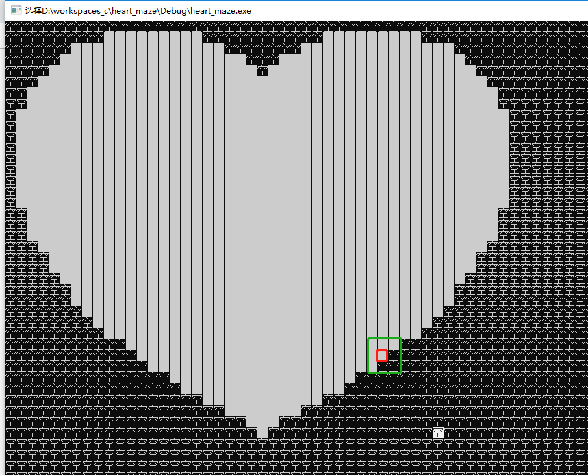
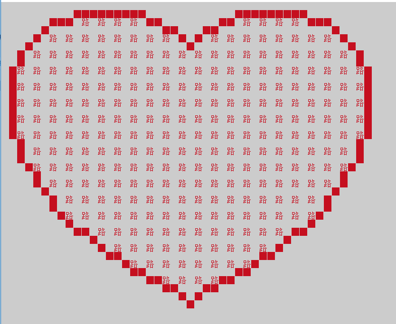
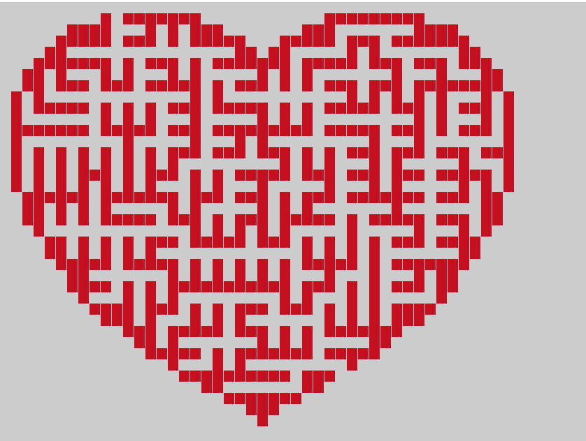

### 找到爱心的边框

### 生成迷宫的算法

##### 广度优先遍历，先进先出，可用队列<queue>来解决。

##### 深度优先遍历，先进后出，可用堆栈<stack>来解决。

##### stack和queue的区别就是

代码都是一样的，其实就是出栈的顺序不一样。stack是先进来的后出去，queue是先进来的先出去。因为顺序不一样，所以就产生了深度优先遍历和广度优先遍历。

迷宫生成的算法就是，结合广度优先和深度优先算法，随机进队列，随机出队列。

### 说明

	“空” 代表的是Scene area,场景区【辅助区】

### 转换

	队列也是一种特殊的线性表，是一种先进先出的线性表。允许插入的一端称为表尾，允许删除的一端称为表头
	排在前面的先出，排在后面的后出。换句话，先进的先出，后进额后出。我们在队尾插入数据，队头删除数据。

	cpp:
	
		void initQueue(SqQueue &Q)
		Q.data
	
	c：
		
		void initQueue(SqQueue *Q)
		Q->data

	//为了避免当只有一个元素时，队头与队尾重合，影响我们的操作。所以，我们引入了front、rear指针。

	typedef struct {
	Block *data;//存入的结构体数据
	int front;//front指向第一个元素的位置
	int rear;//rear指向最后一个元素的下一个位置。
	}SqQueue;

### 参考文档

[https://github.com/neolay/HeartMaze](https://github.com/neolay/HeartMaze)

	

